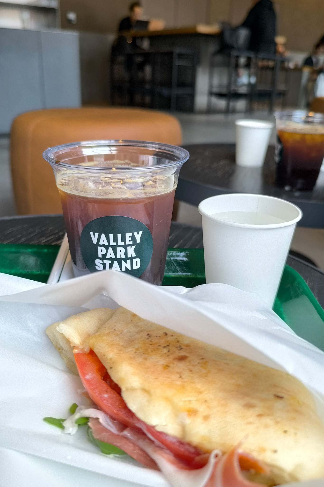
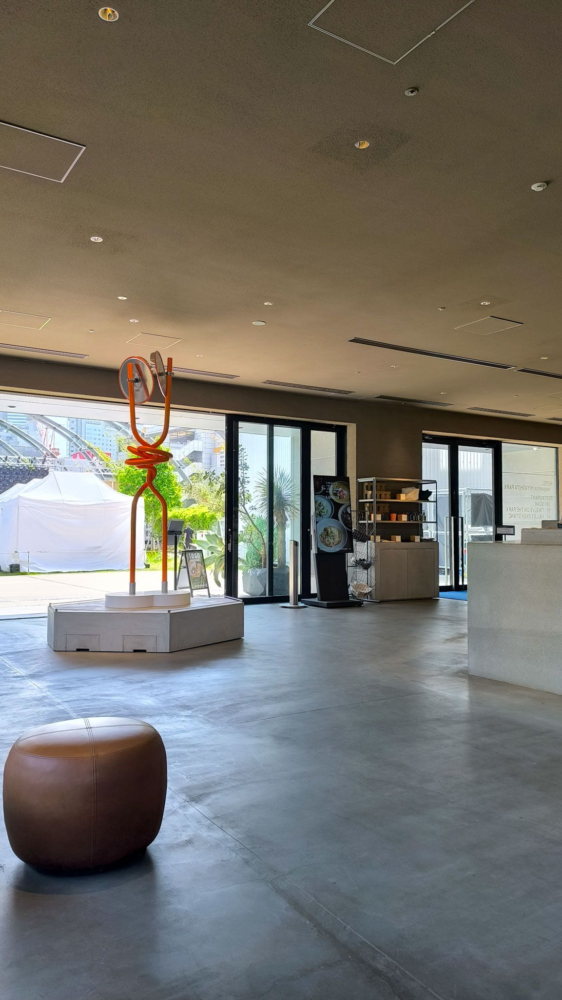
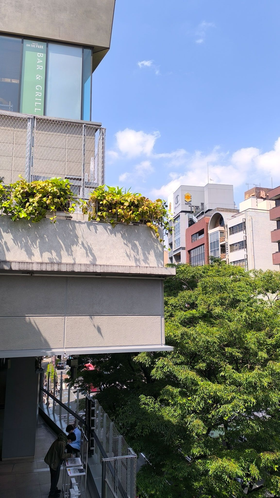
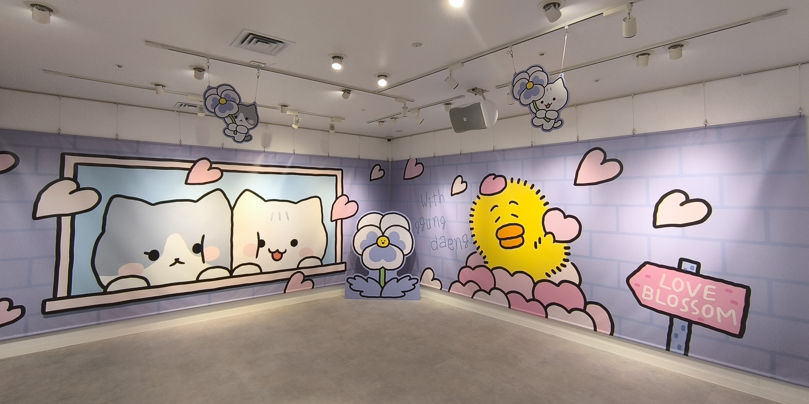
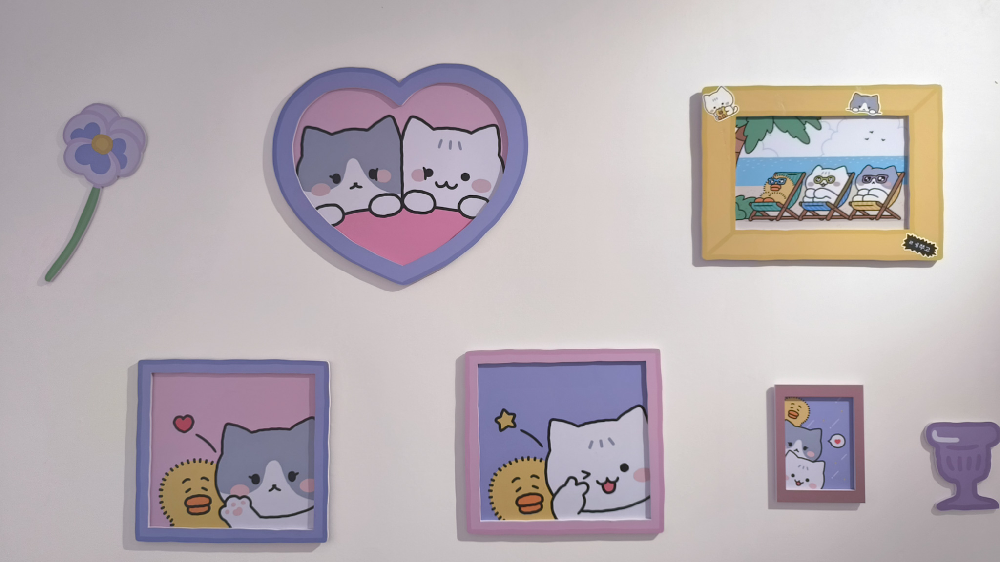
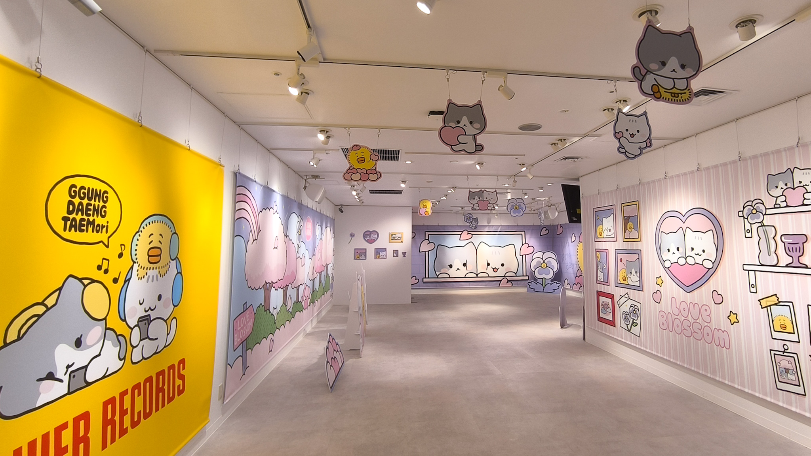
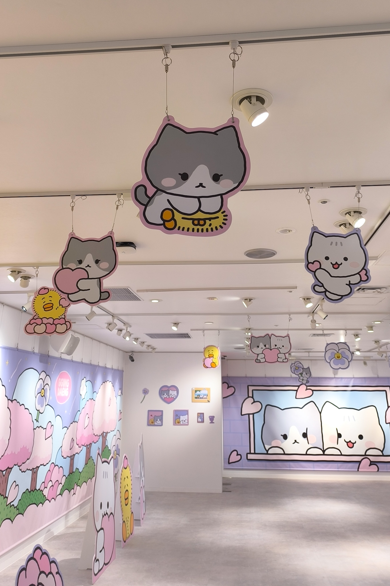
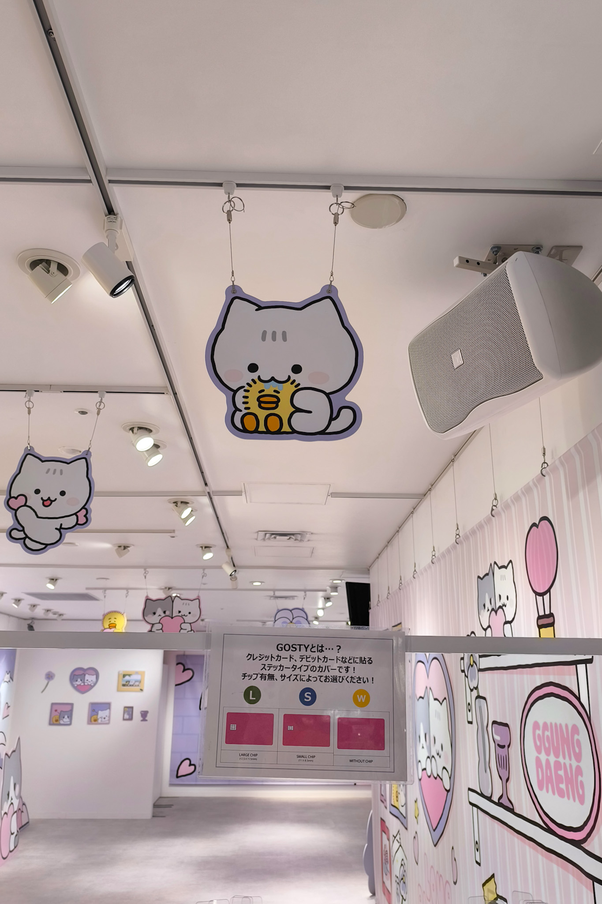
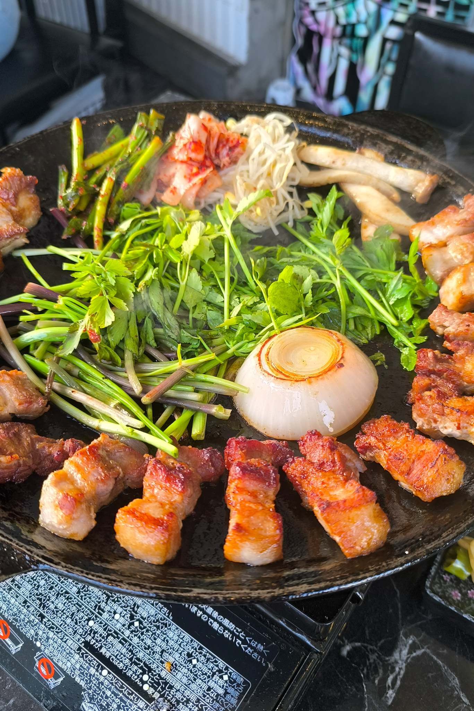

GW、テミンの愛猫クン＆デンのポップアップがあったので行ってきた！

久々の渋谷、日曜で人が多いと嫌だなあと思っていたけど、

宮下パークのカフェが意外と落ち着いた感じでよかった。

同じビルにスタンドオイルも入ってて、ぶらっと鞄を見たりした。


  
  
  


ポップアップは14:00入場の回でチケットをとっていて、13:30には列ができ始める感じだった。

１回で入場する人数もちょうどいい感じで、映り込みなく写真撮れてよかった～


  
  
  
  
  


セーブしつつ、いろいろ買ったあと… 久々に新大久保に行ってミナリサムギョプサルを食べた。

ミナリはセリのことなんだけど、流行ってるみたいでいろんなところで見る。

しっかり香りがあって、お肉との相性抜群だった！


  
