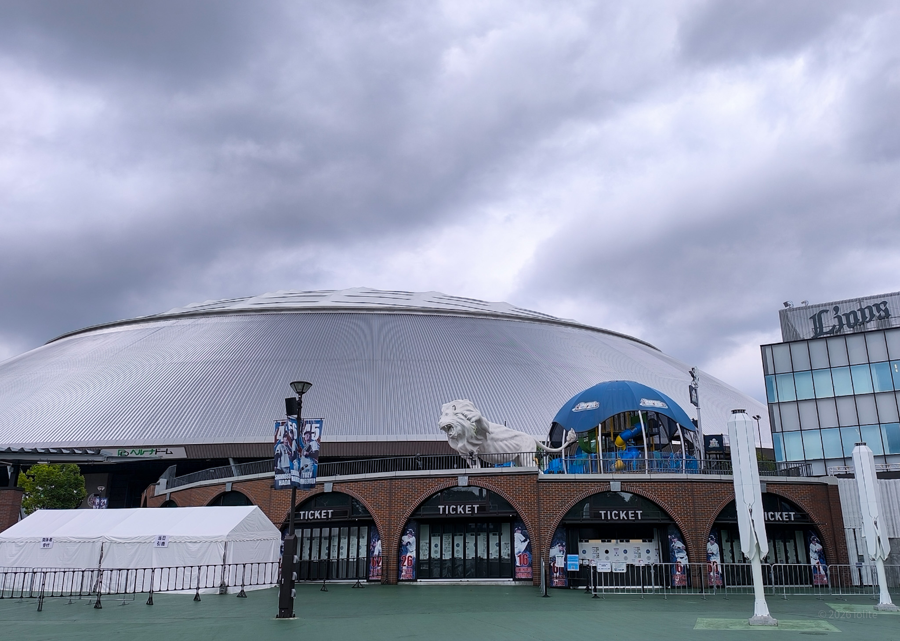
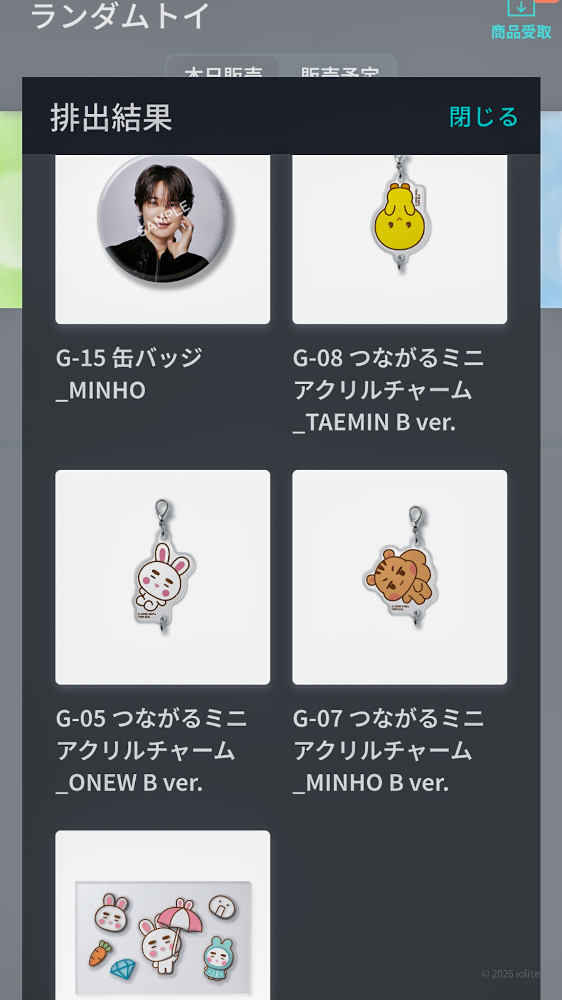
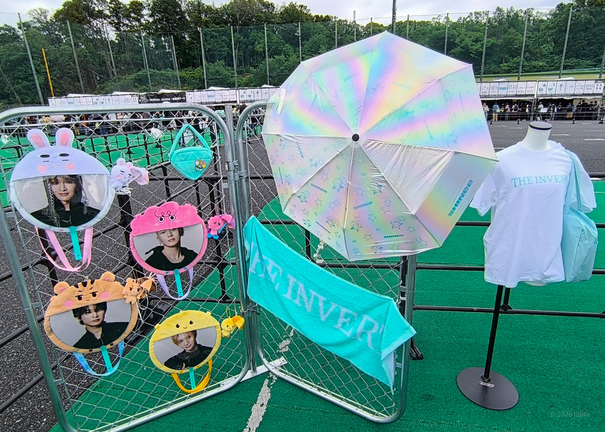
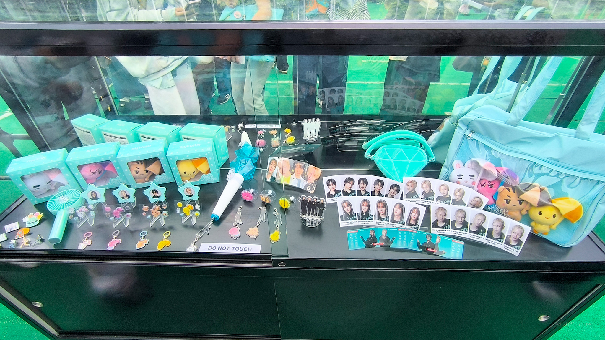
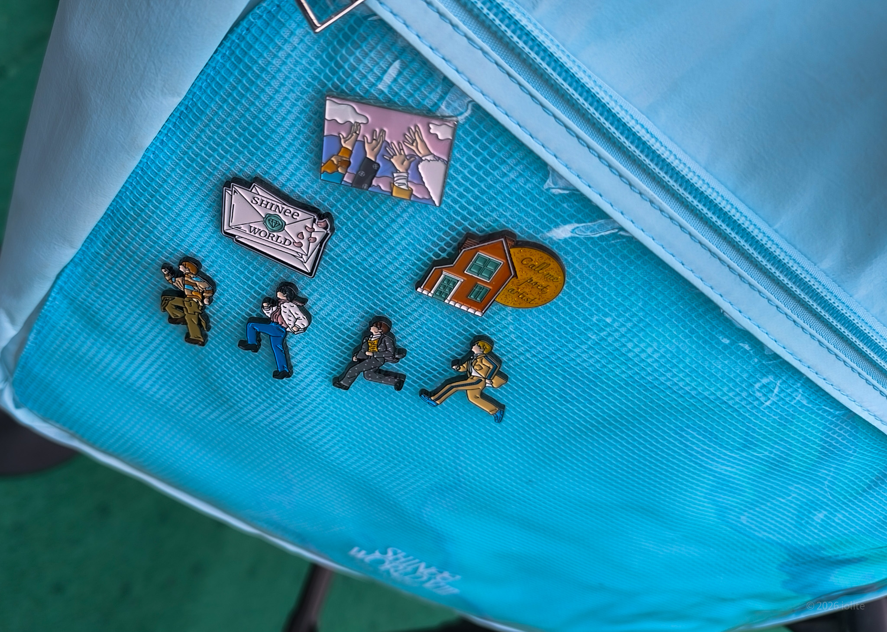
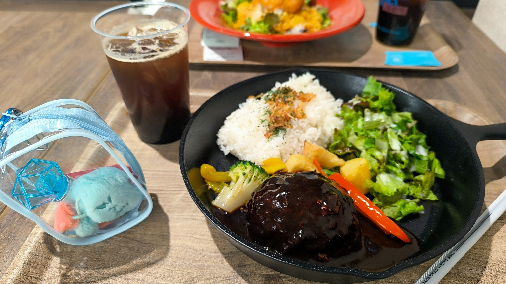
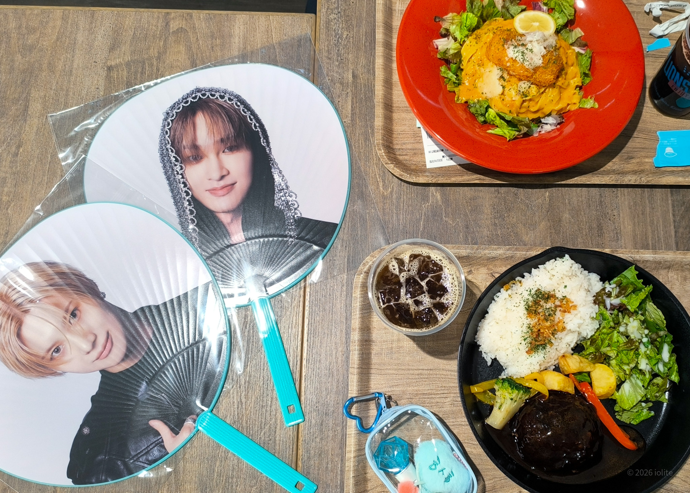

6/5(金)、SHINeeのライブ「- The Trilogy I - 2026 SHINee WORLD VIII : [THE INVERT]」に行ってきた！
4人そろっての日本公演はなんと8年ぶり・・・

初めてのベルーナドーム。地獄と聞くのでめちゃくちゃ心配してたんだけど、ラッキーなことに暑くも寒くもなく、フツーに快適な１日を過ごせた。

備忘録としていろいろ綴るけど、それは大したことじゃないので
最後の方の動画だけ見てもらえばOKです！！！

## 交通手段
帰りの電車を心配して途中で帰るのは嫌だったので、走りなれない道は若干不安があったけど車で行くことに。

駐車場調べておくか～と思ったときには予約できる駐車場はひとつも開いてなくて。当日は家を早く出て、予約制じゃない駐車場を確保しなきゃ！って意気込んだけど、なんか普通に余裕だった。

ぼったくりプライスの駐車場が多い中そこは１日千円で停められるし、会場からめちゃ近いのに裏道へ抜けやすくて、帰りもそんな渋滞に巻き込まれなくて大正解だった！

行きは高速に乗って（三郷で若干渋滞）、帰りはご飯食べながら下道で帰ったんだけど思ったより走りやすかった。

## 物販から開場まで
確か10時前には駐車場停めてたんだけど、朝早かったのでちょっと寝たりしつつ11時過ぎにはグッズ列並んで、12時にはグッズ販売開始。（私は並んでないけど一般販売ブースの流れがすごい遅かった）

会場限定ガチャだけ回したんだけど、なかなかの神引き…！ボンボンシールが想像以上に可愛くてビックリした！！（このあとチェミノの缶バッジはボクシリのチャームに交換していただき、無事コンプ）


  
  
  
  


グッズ購入後はレストランでご飯食べた！ちゃんと美味しくてコーヒーたっぷりなのうれしかった！何よりも、ずっとSHINeeのMV流れてて最高の空間だった～。


  
  


なお、レストランでゆっくりしたあとは開場時間まで車でお昼寝してた。（これができるから会場近くの駐車場に停められてめちゃくちゃよかった…）

## トイレ事情
トイレの1時間待ちはザラと聞いていたんだけど、そんなに困ることはなかった。

入場する前、レストランがある建物の地下のトイレに行ったんだけど、みんな1階に並んでて地下には1人もいなかった。。ちなみに地下には大量のロッカーとモバイルバッテリーもあってとてつもなく助かった…（レストランのは電源入ってなくて借りれなかった）

場内では個室多めと聞いてゲートから一番遠いところに行ったんだけど、流れがよくてここもあまり待たずに済んだ。

なおライブ中のトイレ対策として豆大福を持っていき直前に食べたんだけど、あれお茶飲みたくなるよね。飲んでいいのかよく分からなかった。

みんな大福ほおばってた。

## ライブ感想
セトリ神！！！！！！！って毎回言ってる！！！
なぜなら神曲しかないからだった！！！
神セトリにしかならない！！！！神！！！！

<iframe data-testid="embed-iframe" style="border-radius:12px" src="https://open.spotify.com/embed/playlist/1aB6Wzcux5xH1mVrVALXPC?utm_source=generator&si=18754896353a4fe3" width="100%" height="352" frameBorder="0" allowfullscreen="" allow="autoplay; clipboard-write; encrypted-media; fullscreen; picture-in-picture" loading="lazy"></iframe>

日本公演は懐かしの日本オリジナルも入れてくれて、
こんなのいつぶりだろうってくらいみんなキャッキャしてて、
テミンなんかソロじゃ絶対見れないマンネ大爆発のはしゃぎっぷりで赤ちゃんだった！！！

「Boys Meet U」とか「I'm Your Boy」の時ってたぶん一番イルコンしてた時期だし、
私もあんなにライブ行くこと後にも先にもないと思う…
一気にあの頃がよみがえって、なんかすごい時間の概念ばぐったね

そうそう、あの頃しゃいにキッズとしてライブに参加していたしゅり君が
今回「Anti Believer」の振付を行ったとかで、それだけでもビックリなのに

そんなことも知らずライブで初めて見たときに、
「なんかここの拍だけ抜けてるような振付だな～」って感じてた違和感は、
ジョンのための拍だったっていうのを後から知って感無量；；

しゃいには５人だっていうのが、いつも必ずどこかにあるので、
ジョンやあの頃に対する想いがおいてけぼりにならずにすんでいるんだと思う。

そして九州の山奥で聴きまくった6集…
今回のライブにも結構組み込まれてて、
「All Day All Night」の入りから鳥肌～
「Electric」は⚡な感じの振りと演出が最高にカッコよくて
（私の推しダンサーちゃんのRedyが振付だった！）
終盤の「Chemistry」マジでありがとうございました；；；；；；
ぐるんっていうあの振りが好きなんだーーおにゅさんのケミ見れて幸せ；；

なんといっても４人のイルコンは８年ぶりだったので
どの曲もやっと見れたよという感じがすごくて…もう……

「별빛 바램」や「Green Rain」も聴けて嬉しかったなあ

「Thousand Miles Away」は壮大さを感じる楽曲で癒されるんだけど
オニュさんの抜群の聴かせどころがあってな…これはまたすぐ生で聴きたい……

今回のミニアルバムのリードトラック「Atmos」は言うまでもなくカッコよかった…
ファンの声が届いて唯一叶った今回のメディア露出、人気歌謡の動画でも貼っておく。
カメラマン気合入ってんね！（カメラワークにうるさい女）

<iframe width="560" height="315" src="https://www.youtube.com/embed/BaHf6hiyRAs?si=qGfwl-Y_dl75mQ2N" title="YouTube video player" frameborder="0" allow="accelerometer; autoplay; clipboard-write; encrypted-media; gyroscope; picture-in-picture; web-share" referrerpolicy="strict-origin-when-cross-origin" allowfullscreen></iframe>

もうずっとソロ活動ばかりを追ってるような状態だったけど、やっぱり皆そろうとグループでしか見せない顔があって、、、幸せしかなかった、、もっとグループ活動してほしいのが本音だけど…無理もしてほしくなくて。いろんなこと考えたら年イチのライブとペンミでも……それすら贅沢？

今回のライブは三部作の一作目なので、また来年二部があることが約束されているんだけど、それまで全くSHINeeの活動がないとは私思ってなくて…期待しててよいでしょうか……

そういえば、メント中に日本で新曲出すようなことをこぼしてて一部で歓声が起こってたんだけど、違う意図だった可能性もあって、勘違いだったのか何だったのか未だによく分かっていない。

でもみんなソロもまたあるだろうし、来年までお預けも全然ありうる。
いや、もう年イチでいいからずっと約束して…

っていうか、中止になってしまったKEYLANDのジャパンホールツアーやってほしいよ！やっぱりアイドルしてるキボミが好きだと心底思ったよ！おかえり！！！

（おわり）

